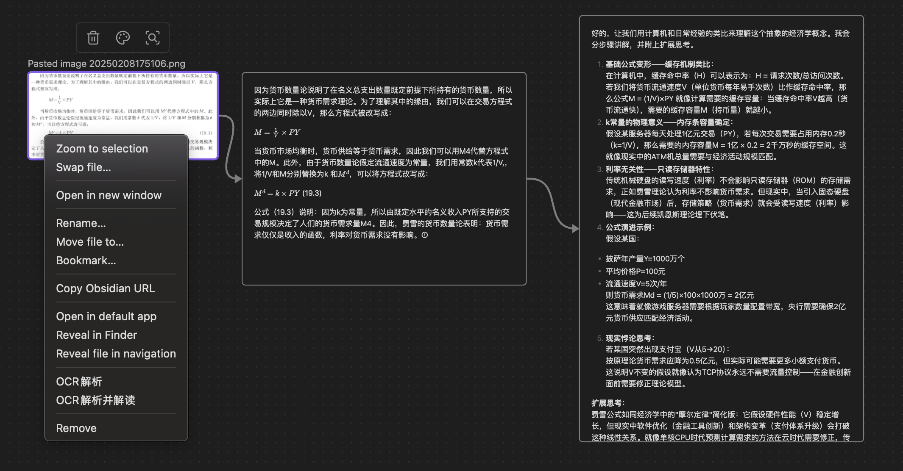

# Conknow 阅读助手

*Note: 代码和文档均来自cursor*

*配套[飞书同步机器人](feishu-ocr-bot/README.md)*

===

这是一个 Obsidian 插件，它能够帮助用户通过 OCR 技术识别图片中的文字，并利用 AI 进行智能解读，支持在普通笔记和 Canvas 画布中使用。



vx：c2h1aXNodWlqaWFvemk (base64，末尾加一个等号)

## 主要功能

- **OCR 图片识别**
  - 支持在普通笔记和 Canvas 画布中识别图片文字
  - 支持多种图片格式：png、jpg、jpeg、gif、bmp、pdf
  - 使用 Textin OCR API 进行高精度文字识别

- **AI 智能解读**
  - 支持多个 AI 模型：
    - o1
    - o1-mini
    - o1-preview
    - gpt-4o
    - deepseek-chat
    - deepseek-reasoner
  - 可自定义系统提示词，优化 AI 解读效果
  - 在 Canvas 中自动创建关联节点和连接线

- **Canvas 增强功能**
  - 支持在画布中为图片节点添加 OCR 结果节点
  - 支持为文本节点添加 AI 解读节点
  - 自动创建节点之间的关联关系

## 安装方法

1. 下载此插件的最新版本
2. 将文件解压到你的 Obsidian vault 的 `.obsidian/plugins/conknow-reading-assistant/` 目录下
3. 在 Obsidian 设置中启用插件
4. 在插件设置中配置必要的 API 信息

## 配置说明

### Textin OCR 设置
- API 地址：Textin OCR 服务的 API 地址
- API ID：你的 Textin API ID
- API Secret：你的 Textin API Secret

### Deepseek AI 设置
- API Base URL：Deepseek API 的基础地址
- API Key：你的 Deepseek API 密钥
- 模型：选择要使用的 AI 模型
- 系统提示词：自定义与 AI 对话的系统提示词

## 使用方法

### 在普通笔记中使用
1. 右键点击笔记中的图片
2. 选择"OCR解析"可以只识别文字
3. 选择"OCR解析并解读"可以同时获得 AI 的智能解读

### 在 Canvas 画布中使用
1. 右键点击画布中的图片节点
2. 选择"OCR解析"将在右侧创建文字识别结果节点
3. 选择"OCR解析并解读"将创建文字识别结果节点和 AI 解读节点
4. 右键点击任意文本节点，可以使用不同的 AI 模型进行解读

## 开发

```bash
# 安装依赖
npm install

# 开发模式
npm run dev

# 构建
npm run build
```

## 许可证

MIT 