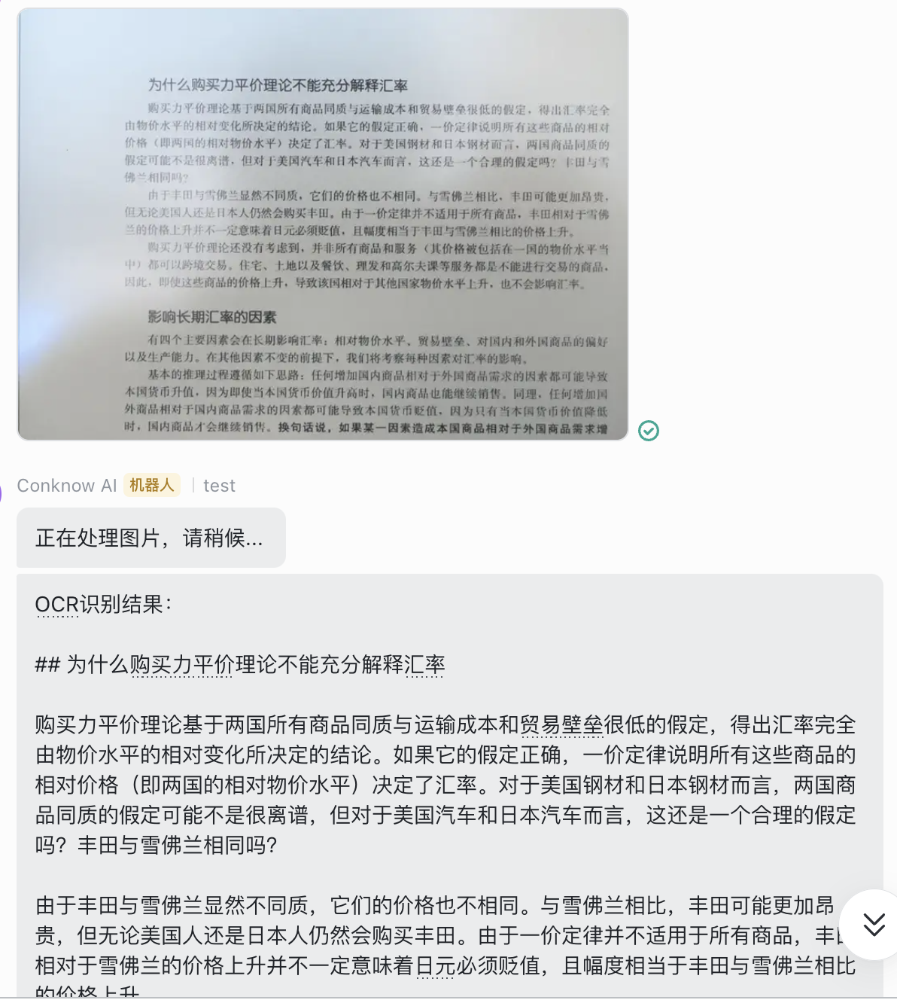

# 飞书OCR机器人

*Note: 这是 [Conknow 阅读助手](../README.md) 的配套飞书机器人服务*

===

这是一个功能强大的飞书机器人服务，它不仅能自动识别群聊中的图片文字，还支持与Obsidian知识库同步，并提供AI智能解读功能。



## 主要功能

- **OCR 文字识别**
  - 自动监听群聊中的图片消息
  - 使用 Textin API 进行高精度 OCR 识别
  - 支持多种图片格式
  - 异步处理，响应迅速

- **Obsidian 同步**
  - 自动将图片保存到 Obsidian 附件目录
  - 创建结构化的笔记文件
  - 支持多图片批量处理
  - 自动生成包含原文、图片、OCR结果的笔记

- **AI 智能解读**
  - 支持对识别文本进行 AI 分析
  - 使用 Deepseek API 进行内容解读
  - 可自定义系统提示词
  - 分析结果自动同步到 Obsidian

## 环境要求

- Python 3.8+
- 飞书开发者账号
- Textin API 账号
- Deepseek API 账号（可选，用于 AI 分析）
- Obsidian（可选，用于知识管理）

## 安装步骤

1. 克隆项目到本地：
```bash
git clone [项目地址]
cd feishu-ocr-bot
```

2. 安装依赖：
```bash
pip install -r requirements.txt
```

3. 配置环境变量：
编辑 `config/config.py` 文件，配置以下信息：

### 飞书配置
```python
FEISHU_APP_ID = "你的飞书App ID"
FEISHU_APP_SECRET = "你的飞书App Secret"
FEISHU_VERIFICATION_TOKEN = "你的验证Token"
FEISHU_ENCRYPT_KEY = "你的加密密钥"
```

### Textin OCR配置
```python
TEXTIN_API_URL = "https://api.textin.com/ai/service/v1/pdf_to_markdown"
TEXTIN_API_ID = "你的Textin API ID"
TEXTIN_API_SECRET = "你的Textin API Secret"
```

### Obsidian配置（可选）
```python
OBSIDIAN_ENABLED = True  # 是否启用Obsidian同步
OBSIDIAN_VAULT_PATH = "你的Vault路径"
OBSIDIAN_ATTACHMENT_DIR = "attachments"  # 附件目录
OBSIDIAN_SYNC_DIR = "sync"  # 同步目录
```

### AI配置（可选）
```python
AI_BASE_URL = "https://api.deepseek.com/v1"
AI_API_KEY = "你的Deepseek API密钥"
AI_MODEL = "deepseek-chat"
AI_SYSTEM_PROMPT = "自定义系统提示词"
AUTO_AI_ANALYSIS = True  # 是否自动进行AI分析
```

## 使用方法

1. 启动服务：
```bash
python -m src.main
```

2. 配置飞书机器人：
   - 在[飞书开发者平台](https://open.feishu.cn/)创建应用
   - 开启机器人功能
   - 配置消息订阅，添加事件 `im.message.receive_v1`
   - 设置请求网址为：`http://your-domain:7000/webhook/feishu`

3. 在群聊中使用：
   - 将机器人添加到群聊
   - 发送图片即可自动进行以下处理：
     - OCR识别文字
     - 保存到Obsidian（如果启用）
     - AI解读（如果启用）

## 功能流程

1. 图片处理流程：
   - 接收群聊图片
   - OCR识别文字
   - 保存图片到Obsidian附件目录
   - 创建包含图片和OCR结果的笔记
   - 进行AI解读（如果启用）
   - 将结果发送回群聊

2. Obsidian笔记结构：
   - 标题和时间戳
   - 原始文本（如果有）
   - 图片链接
   - OCR识别结果
   - AI分析结果（如果启用）

## 注意事项

- 确保服务器有公网访问权限
- 妥善保管各项API密钥和密码
- 建议使用HTTPS进行安全传输
- 确保在项目根目录下运行程序
- Obsidian同步功能需要正确配置vault路径
- 建议定期检查日志文件排查问题

## 许可证

MIT License 